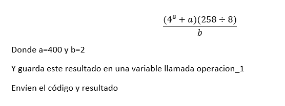
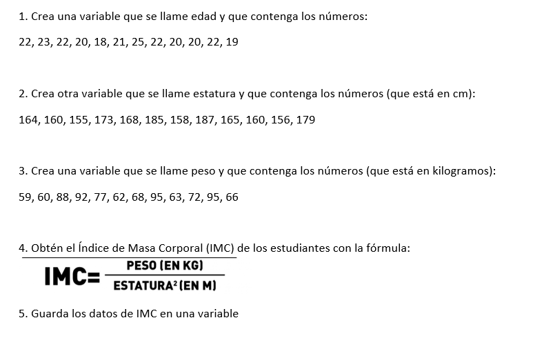

##3.2. Cómo instalar paquetes

```{r}
#install.packages("dpylr") 
#install.packages(c("foreign", "readxl", "car", "plyr", "dplyr"))

library(dplyr)
library(foreign)
library(readxl)
library(car)
library(plyr)
```
También se puede hacer manualmente en la ventana de Packages.

##4.1.1. Aritmética 

1. + Adición
2. - Sustracción
3. * Multiplicación
4. / División
5. ^ Exponente 
6. %/% División de enteros
7. %% Resto de la división de enteros
8. abs Absolute value
9. exp Exponencial 
10. log Logaritmo
11. log10 Logaritmo de base 10
12. sqrt Raíz cuadrada
13. floor Entero más grande, less than or equal to
14. ceiling Entero más pequeño, greater than or equal to
15. factorial Factorial

```{r}
2+1
1 + 2 - (3 * 4 / 5) ^ 6
sqrt(5^2 + 7^2)
log(5632)
exp(3)
```

##4.1.2. Operadores lógicos
1. > Mayor que
2. < Menor que
3. >= Mayor o igual a
4. <= Menor o igual a
5. == Igual a
6. != Desigual a
7. &  And (y)
8. |  Or (o)
11. !  not (no)
```{r}
55 < 69
100 <= 100
30 != 20
```
##4.1.3. Funciones trigonométricas
1. cos cosine
2. sin sine
3. tan tangent
4. acos arc cosine
5. asin arc sine
6. atan arc tangent
7. cosh hyperbolic cosine
8. sinh hyperbolic sine
9. tanh hyperbolic tangent
10. acosh arc hyperbolic cosine
11. asinh arc hyperbolic sine
12. atanh arc hyperbolic tangent
```{r}
cos(500)
sin((30 / 180) * pi)
```

##4.2. Objetos y variables

Un objeto es un nombre/una unidad que puede utilizar para recuperar los datos almacenados o tareas almacenadas. Por ejemplo, puede guardar datos en un objeto como a o b. 

Para crear un objeto R, elija un nombre y luego use el símbolo menor que, <, seguido de un signo menos, -, para guardar los datos en él. Esta combinación parece una flecha hacia la izquierda <-
  
Se puede nombrar un objeto en R casi cualquier cosa que desee, pero hay algunas reglas: 
* No puede comenzar con un número
* No puede usar algunos símbolos especiales, como ^, !, $, @, +, -, /, *, :
* No puede llevar espacios
* De preferencia no usar acentos
* De preferencia no usar el nombre de funciones preexistentes en R, como pi

Nota: R sobrescribirá cualquier información previa almacenada en un objeto sin pedirle permiso. Por lo tanto, es una buena idea no usar nombres que ya están en uso, a menos que eso es algo que tú quieras. Esto se llama *squash de objetos*.


```{r}
a <- 5 
b <- 6 #Observen cómo se van creando los objetos/variables en el environment
x <- 22
y <- 48.5
z <- 32.54
#mamá <- 2
#Datos_internos <- 
#DatosInternos <-

#texto_1 <- Este es un texto
texto_1 <- "Este es un texto" #Es una variable de strings
texto_1 <- 'Este también es un texto'


operacion <- (1 + 2) - (3 * 4) / 5  #Igual lo pueden hacer directamente en la consola
#cadena_num <- 1,2,3,4,5
cadena_num <- c(1,2,3,4,5) #Esta línea hace concatenación de números
cadena_text <- c("Hola", "Qué tal", 'Todo bien', '     Qué bueno')
nombres <- c("María", "Alicia", "Juan", "Julián", "Gabriela")
edad <- c(22,21,24,18,20)

a+b
c <- a + b
#variable <- texto_1 + a
#c_text <- "a"+"b"
c_texto <- c("a","b")
numeros <- c("1", "2", "3")


pi
pi <- 5
```



```{r, results='hide'}
edad = c(22, 23, 22, 20, 18, 21, 25, 22, 20, 20, 22, 19)
estatura <- c(164, 160, 155, 173, 168, 185, 158, 187, 165, 160, 156, 179)
peso <- c(59, 60, 88, 92, 77, 62, 68, 95, 63, 72, 95, 66)
estatura <- estatura/100
IMC <- peso/estatura^2
```


##4.3. Funciones
Una característica clave de R son las funciones. Las funciones son módulos de código "autónomos" que realizan una tarea específica. Las funciones generalmente toman algún tipo de estructura de datos (valor, vector, etc.), la procesan y devuelven un resultado.

El uso general de una función es el nombre de la función seguido de paréntesis:
function_name(input) 
Aunque hay algunas excepciones de funciones que no reciben input.

```{r}
log(350)
```
Si no conoces para qué sirve una función puedes irte a la pestaña de help 
```{r}
?log
```

También puedes crear funciones desde cero:

name_of_function <- function(argument1, argument2) {
    statements or code that does something
    return(something)
}
```{r}
square_it <- function(x) {
    square <- x * x
    return(square)
}
square_it(5)
```

##4.4. Working directory
```{r}
setwd("C:/Users/Lenovo/Documents/CursoInterRparaTodxs") #Set working directory

getwd() #Get working directory
```


