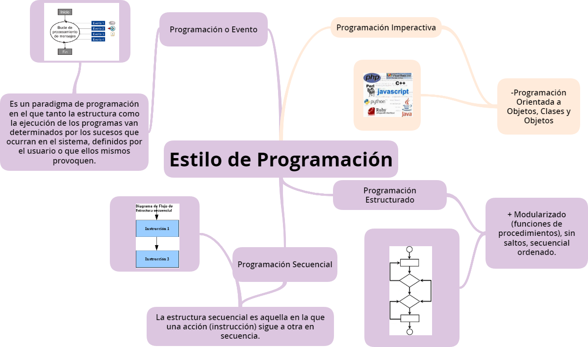
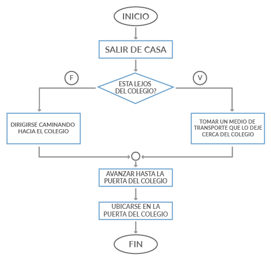
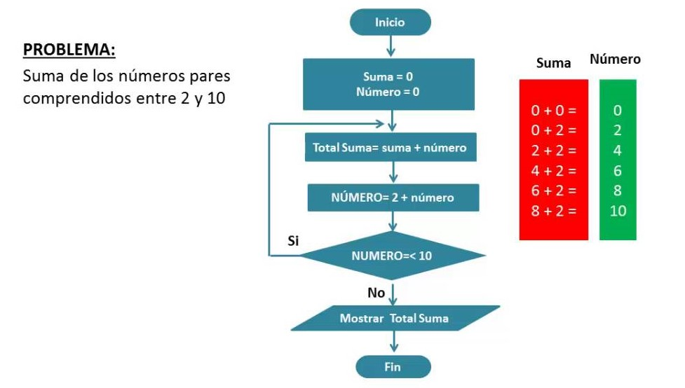
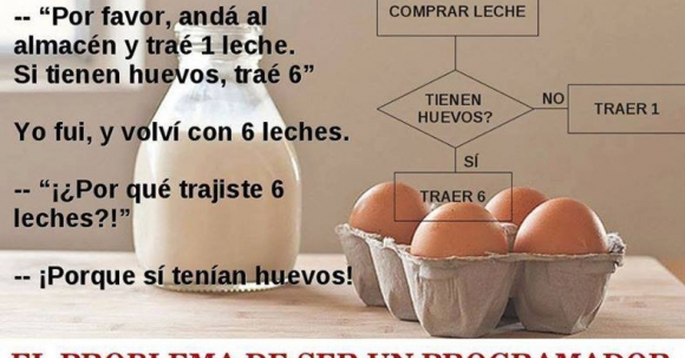

##Introducción a la programación
Las computadoras ejecutan órdenes en un formato que les es entendible, estas órdenes se agrupan en lo que nosotros conocemos como un programa, o  software. 

En ocasiones es necesario realizar la **programación** para la resolución de problemas, pero se debe de comprender que **no es solo el realizar código**, sino que hay más trabajo detrás para que lo que se pretende crear sea funcional. La **programación** es un proceso que diseña, crea, ejecuta y corrige un código fuente.

Se debe transformar el problema inicial en un algoritmo, representación gráfica por medio de diagrama de flujo, introducir el lenguaje con pseudocódigo y por último realizar el programa.

### Algoritmos

Un algoritmo constituye una lista bien **definida, ordenada y finita de operaciones** que nos permitirá encontrar solución al problema comenzando desde su estado inicial hasta el estado final. El algoritmo es la propia secuencia de instrucciones para la ejecución de una tarea. La información en un algoritmo tiene que ser clara y detallada, tener una secuencia correcta y bien definida de las acciones.

Las etapas de desarrollo de un algoritmo con base lógica: 
Primero se deberá de **definir** el propósito, el problema que se quiere resolver y lo que pretende lograr con su solución, para luego **analizar** el problema y sus características para determinar sus entradas y salidas; y ver si ya existen soluciones al problema. A continuación, se deberá de **diseñar** el planteamiento de la solución donde se puedan usar diagramas de flujo y pseudocódigo. Ya como último paso es la **implementación** donde se realiza o se ve ya concretado el programa.

### Diagramas de Flujo

Son un lenguaje específico de algortimo que se realiza de manera gráfica por medio de símbolos que permite ver el proceso de forma más entendible. Son utilizados para poder **ordenar los pasos que a seguir**, o acciones a realizar, presentado la información de manera clara **sin necesidad de conocimientos mayores de programación.**
Estos diagramas se leen de arriba a abajo y están compuestos por **bloques que son conectados a través de flechas** que darán sentido. 

* Un bloque específico para el inicio y el final.
* Para las operaciones de entrada o salida se usan paralelogramos.
* Para hacer asignaciones serán rectangulares o cuadrados. 
* Una decisión con base en una expresión lógica se usará un bloque en forma de rombo.

### Pseudocódigo

El pseudocódigo, o falso lenguaje, es un tipo de lenguaje de algoritmo. Está compuesto por palabras con un cierto formalismo con los cuales se pretende **describir el funcionamiento de un programa.** Se utiliza tanto lenguaje común como instrucciones de programación para la explicación de estructuras básicas para enfocarse en los aspectos lógicos de la solución del problema.

Una forma de empezar es:
* Declarar las variables
* Delimitar las estructuras empleadas, las cuales deben tener un inicio y un fin.
* Identificar los mensajes que se desean escribir a los usuarios.

Para describir las instrucciones de los algoritmos se usarán en el pseudocódigo las estructuras de control; 
las cuales son cuatro:

* Secuencial: De arriba hacia abajo, una después de la otra.

* Selectiva: Elecciones durante el proceso de resolución. Se usan expresiones lógicas como "Si-entonces"

* Iterativa: Son las estructuras iterativas "mientras" (while), "repetir" (repeat) y "para" (for).
    
* Anidamiento: Una iterativa en otra.

